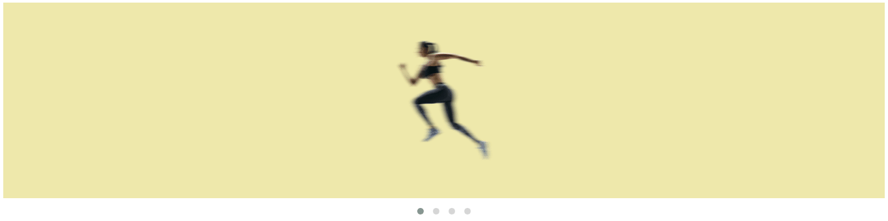

# Ui-Component-OwlCarousel2-Animated🎡

## Basic FadeIn & SlideIn Animation, (used in many websites), editied in jQuery Dependent OwlCarousel 2. 🎭

### A Simple Editable Owl Carousel Animation, Custom Made, For Each Item, [Owl Carousel](https://owlcarousel2.github.io/OwlCarousel2/), jQuery, HTML5/CSS3, CSS3 Keyframes.
Owl Carousel Fades into Next Slide, as Content inside Slide Slides Up with Keyframes.
 
Basic Simple and Easy To Use. 😎

## DEMO😍:

---

## [TRY HERE](https://arslanameer.github.io/Ui-Component-OwlCarousel2-Animated/) 😍

[ © Copyrights [Arslan Ameer](http://www.arslanameer.com/) ]

---

# 🔐LICENSE:

Ui-Component-OwlCarousel2-Animated © Copyright 2019 by **[Arslan Ameer](http://www.arslanameer.com/)**

Licensed under the Apache License, Version 2.0 (the "License");
you may not use this file except in compliance with the License.
You may obtain a copy of the License at

    http://www.apache.org/licenses/LICENSE-2.0

Unless required by applicable law or agreed to in writing, software
distributed under the License is distributed on an "AS IS" BASIS,
WITHOUT WARRANTIES OR CONDITIONS OF ANY KIND, either express or implied.
See the License for the specific language governing permissions and
limitations under the License..
